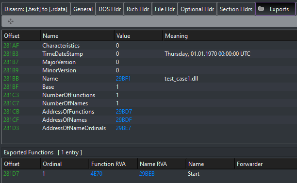

# EXE_to_DLL

[](https://ci.appveyor.com/project/hasherezade/exe-to-dll)
[](https://github.com/hasherezade/exe_to_dll/releases)
[](https://github.com/hasherezade/exe_to_dll/releases)

Converts an EXE, so that it can be loaded like a DLL.<br/>
<b>Supports both 32 and 64 bit DLLs</b>

***Inspired by the idea of [@guywhataguy](https://github.com/guywhataguy/). Read more [here](https://blog.vastart.dev/2020/04/calling-arbitrary-functions-in-exes.html).***

## Download

Stable builds are available in [releases](https://github.com/hasherezade/exe_to_dll/releases).

Test builds can be downloaded from [the build server](https://ci.appveyor.com/project/hasherezade/exe-to-dll) (click on the build and choose the "Artifacts" tab)

## Clone

Use recursive clone to get the repo together with all the submodules:
```
git clone --recursive https://github.com/hasherezade/exe_to_dll.git
```

## Usage

Run `dll_to_exe` from commandline. Arguments:

```
args: <input_exe> <output_dll>
```

Example:

```
exe_to_dll.exe test_case1.exe test_case1.dll
```

After the successful conversion you should obtain a DLL exporting a `Start` function. This is the Original Entry Point of your input application.



You can test it by running:

```
rundll32.exe test_case1.dll,Start
```
